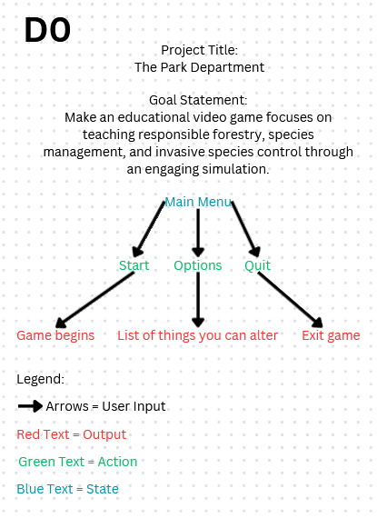
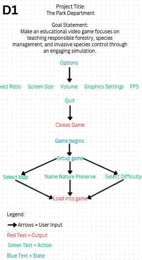
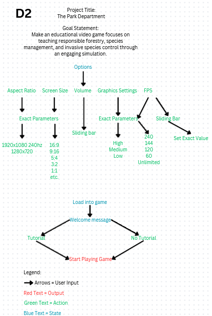

# The Park Department

## Table of Contents
You can also use the default github table of contents too!
- [The Park Department](#the-park-department)
  - [Table of Contents](#table-of-contents)
  - [Team names and Project Abstract](#team-names-and-project-abstract)
  - [Project Description (Assignment #2) - Kyle TODO](#project-description-assignment-2---kyle-todo)
  - [User Stories and Design Diagrams (Assignment #4)](#user-stories-and-design-diagrams-assignment-4)
    - [User Stories](#user-stories)
    - [Design Diagrams: Level 0, Level 1 and Level 2](#design-diagrams-level-0-level-1-and-level-2)
      - [Summary of Design](#summary-of-design)
      - [**Conventions in the Diagrams**](#conventions-in-the-diagrams)
      - [**Level D0 (High-Level Design)**](#level-d0-high-level-design)
      - [**Level D1 (Intermediate Design)**](#level-d1-intermediate-design)
      - [**Level D2 (Detailed Design)**](#level-d2-detailed-design)
  - [Project Tasks and Timeline (Assignment #5-6) - Ryan TODO](#project-tasks-and-timeline-assignment-5-6---ryan-todo)
    - [Task List](#task-list)
    - [Timeline](#timeline)
    - [Effort Matrix](#effort-matrix)
  - [ABET Concerns Essay (Assignment #7) - Kyle TODO](#abet-concerns-essay-assignment-7---kyle-todo)
  - [PPT Slideshow (includes ABET Concerns) (Assignment #8)](#ppt-slideshow-includes-abet-concerns-assignment-8)
  - [Self-Assessment Essays (Assignment #3) - Everyone TODO](#self-assessment-essays-assignment-3---everyone-todo)
  - [Professional Biographies  (Assignment #1) - Everyone TODO](#professional-biographies--assignment-1---everyone-todo)
  - [Budget](#budget)
    - [Expenses to date](#expenses-to-date)
    - [Show monetary value of donated items and donation sources.](#show-monetary-value-of-donated-items-and-donation-sources)
  - [Appendix](#appendix)
    - [References, citations, links to code repositories, and meeting notes.](#references-citations-links-to-code-repositories-and-meeting-notes)
    - [Hours Justification for Team Members](#hours-justification-for-team-members)
  - [Summary of Effort](#summary-of-effort)
  - [Meeting Hours](#meeting-hours)
  - [Additional Assignments](#additional-assignments)
  - [Project Development](#project-development)
  - [Total Hours Breakdown](#total-hours-breakdown)

## Team names and Project Abstract
- Nathan Suer
  - Email: natesuer@gmail.com, suerns@mail.uc.edu 
- Ryan Williams
  - Email: willi5r7@mail.uc.edu
- Kyle Young
  - Email: young4kg@mail.uc.edu
- Owen Richards
  - Email: richaroc@mail.uc.edu 
- William Hawkins III (Advisor)
  - Email: hawkinwh@ucmail.uc.edu 

- Project Abstract - Ryan TODO
This educational video game focuses on teaching responsible forestry, species management, and invasive species control through an engaging simulation. It combines elements of animal reserve management with strategic decision-making. Players can also manage the reserve to raise funds, conduct expeditions to find and conserve animals, and protect the reserve from poachers.

## Project Description (Assignment #2) - Kyle TODO
[Project Description](HW_Assignments/Project-Description.md)

## User Stories and Design Diagrams (Assignment #4)

### User Stories
[User Stories](HW_Assignments/user-stories.md)

### Design Diagrams: Level 0, Level 1 and Level 2

#### Summary of Design
The diagrams (D0, D1, and D2) show the structure and gameplay flow for "The Park Department" game:
1. **D0:** High-level structure with basic menu navigation.
2. **D1:** Mid-level design focusing on options and pre-game setup.
3. **D2:** Detailed configuration options and tutorial onboarding.

#### **Conventions in the Diagrams**
- **Arrows:** Represent user inputs or the flow of interaction.
- **Red Text:** Represents outputs.
- **Green Text:** Represents actions.
- **Blue Text:** Represents states.
- **Goal Statement:** Specifies the game's purpose as a foundation for the design.
- **Legend:** Clarifies the meaning of symbols used (e.g., arrows = user input).

#### **Level D0 (High-Level Design)**
- **Purpose:** Provides a broad overview of the main menu structure and basic interactions.
- **Components:**
  - **Start:** Leads to the game beginning.
  - **Options:** Displays settings players can modify.
  - **Quit:** Ends the game.

#### **Level D1 (Intermediate Design)**
- **Purpose:** Expands on D0 by detailing the options menu and pre-game setup process.
- **Components:**
  - **Options Menu:** Includes settings like aspect ratio, screen size, volume, graphics, and FPS.
  - **Game Setup:** Includes steps for selecting a map, naming the preserve, and setting difficulty.
  - **Quit:** Closes the game, similar to D0.

#### **Level D2 (Detailed Design)**
- **Purpose:** Provides the most detailed breakdown, focusing on options and initial gameplay decisions.
- **Components:**
  - **Options Menu:**
    - **Aspect Ratio and Screen Size:** Allows players to specify exact parameters.
    - **Volume and Graphics Settings:** Adjusted via sliders or presets.
    - **FPS (Frames Per Second):** Allows specific frame rate values or unlimited FPS.
  - **Game Start:**
    - **Tutorial Option:** Gives players the choice to begin with a tutorial or jump straight into gameplay.

## Project Tasks and Timeline (Assignment #5-6) - Ryan TODO

### Task List
[Task List](HW_Assignments/Tasklist.md)

### Timeline
[Timeline](HW_Assignments/Timeline_Table.csv)

### Effort Matrix
[Task List](HW_Assignments/Effort_Matrix.csv)

## ABET Concerns Essay (Assignment #7) - Kyle TODO
[ABET Concerns Essay](HW_Assignments/ConstraintEssay.txt)

## PPT Slideshow (includes ABET Concerns) (Assignment #8)
[Slide Show](https://docs.google.com/presentation/d/1j2VIWUOZVFvMsKo1UwIQpQx6Llhs67gb/edit#slide=id.p1)

## Self-Assessment Essays (Assignment #3) - Everyone TODO
- [Nathan Suer's Self-Assessment Essay](HW_Assignments/Nathan_Suer_Individual_Capstone_Assessment.md)
- [Ryan Williams's Self-Assessment Essay](HW_Assignments/Ryan_Williams_Individual_Capstone_Assessment.md)
- [Kyle Young's Self-Assessment Essay](HW_Assignments/Kyle_Young_Individual_Capstone_Assessment.md)
- [Owen Richards's Self-Assessment Essay](HW_Assignments/Owen_Richards_Individual_Capstone_Assessment.md)

## Professional Biographies  (Assignment #1) - Everyone TODO
- [Nathan Suer's Professional Biography](HW_Assignments/Nathan_Suer_Professional_Bio.md)
- [Ryan Williams's Professional Biography](HW_Assignments/Ryan_Williams_Professional_Bio.md)
- [Kyle Young's Professional Biography](HW_Assignments/Kyle_Young_Professional_Bio.md)
- [Owen Richards's Professional Biography](HW_Assignments/Owen_Richards_Professional_Bio.md)

## Budget 

### Expenses to date
There has no been no expenses so far.

### Show monetary value of donated items and donation sources.
There have been no donations to our project.

## Appendix
### References, citations, links to code repositories, and meeting notes.
We have not used or referenced any other persons work. We are using the Godot engine, which is an open source game engine (https://github.com/godotengine/godot).
### Hours Justification for Team Members

## Summary of Effort
Each team member is required to provide evidence of 45 hours of effort. Below is a breakdown of hours logged through meetings, assignments, and project development.

## Meeting Hours
- **Initial Meeting**:  
  - Date: Tuesday, August 27, 2024  
  - Duration: 2 hours (introduction and planning).  
- **Regular Meetings**:  
  - Start Date: Friday, September 13, 2024  
  - Frequency: Weekly on Fridays, 2 hours each  
  - Total Possible Meetings: 13  
  - Cancelled Meetings: 2 (due to midterms and scheduling conflicts)  
  - Total Meetings: 11
  - Extended Meetings:  
    - 2 meetings ran 30 minutes late (+1 hour).  
    - 2 meetings ran 2 hours late (+4 hours).  
- **Total Meeting Hours**: 29 hours.

## Additional Assignments
- **Professional Biographies**:  
  - Time Spent: 1 hour per team member.  
- **Capstone Assessments**:  
  - Time Spent: 2 hours per team member.

## Project Development
**Individual Contributions**:  
  Each team member has dedicated time to the development of the project to fulfill the remaining 13 required hours. Detailed logs of individual contributions will be provided in the project documentation.

**Nathan Suer**:
  - Coming up with project ideas and initial project design: 3 hours
  - Researching project-related technologies/tools: 4 hours
  - Watching tutorials or reading documentation to improve Godot and game development programming skills: 3 hours
  - Working on Final Design Report - 5 hours
  - Total: 15 hours 
  
**Owen Richards**:
  - Researching Godot/Blender usage, when not working directly in Godot or Blender: 2 hours
  - General work in Godot: 4 hours
  - Creating blender designs including a basic house, pens, animals, people, etc. 4 hours
  - Main Menu design and settings configuration: 3 hours
  - Animal pathfinding/wandering movement: 2 hours
  - Total: 15 hours
    
**Ryan Williams**:
  - TODO
  - Total: ?? hours 

**Kyle Young**:
  - Ideating gameplay features for our project: 1 hour
  - Researching similar games on the market: 1 hour
  - Organizing project into a planned-out file structure: 1 hour
  - Setting up basic scene with ground and orthogonal camera: 1 hour
  - Watching tutorials or reading documentation to improve Godot and game development programming skills: 3 hours
  - Implementing camera panning, rotation, and zoom features: 3 hours
  - Creating and maintaining several important documentation files in the repository: 2 hours
  - Working on Final Design Report: 1 hour
  - Total: 13 hours

## Total Hours Breakdown
| **Category**                 | **Hours**  |
|-------------------------------|------------|
| Meetings (incl. overages) | 29 hours   |
| Professional Biographies      | 1 hour     |
| Capstone Assessments          | 2 hours    |
| Project Development (individual) | 13 hours or more  |
| **Total**                     | **45 hours or more** |
