# The Park Department

## Table of Contents
- [Core Information](#core-information)
  - [Team Members](#team-members)
  - [Project Abstract](#project-abstract)
- [Project Description (Assignment #2)](#project-description-assignment-2)
- [User Interface Specification](#user-interface-specification)
- [Test Plan and Results](#test-plan-and-results)
- [User Manual](#user-manual)
- [Spring Final PPT Presentation](#spring-final-ppt-presentation)
- [Final Expo Poster](#final-expo-poster)
- [Assessments](#assessments)
- [Summary of Hours and Justification](#summary-of-hours-and-justification)
- [Summary of Expenses](#summary-of-expenses)
- [Appendix](#appendix)

## Core Information
### Team Members
- Nathan Suer
  - Email: natesuer@gmail.com, suerns@mail.uc.edu 
- Ryan Williams
  - Email: willi5r7@mail.uc.edu
- Kyle Young
  - Email: young4kg@mail.uc.edu
- Owen Richards
  - Email: richaroc@mail.uc.edu 
- William Hawkins III (Advisor)
  - Email: hawkinwh@ucmail.uc.edu

### Project Abstract
This educational video game teaches responsible forestry, species identification, and invasive species control through an engaging simulation. The game combines the task of growing and maintaining a wildlife reserve with protecting native species, while defusing threats like wildfires or invasive species. Players also grapple with key questions through play, such as raising funds while preserving their mission. 

## Project Description (Assignment #2)
[Project Description](HW_Assignments/Project-Description.md)

## User Interface Specification
### Main Menu
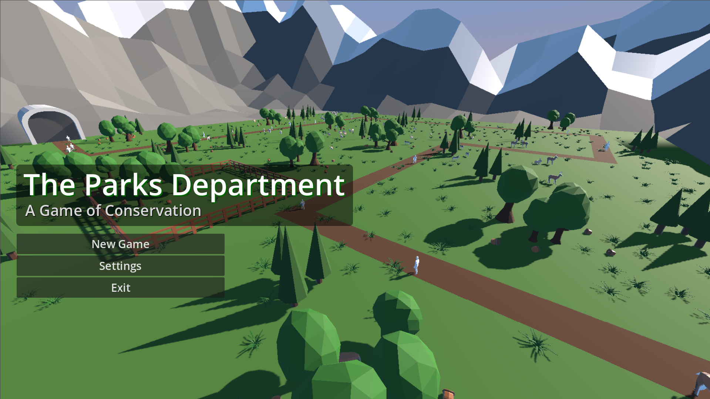  
Start Game - Starts the game.  
Settings - Pop-up settings menu.  
Exit Game - Closes Godot.  

### In-Game UI
There are eight main buttons the user can interact with on the in-game user interface. Working from left to right:  
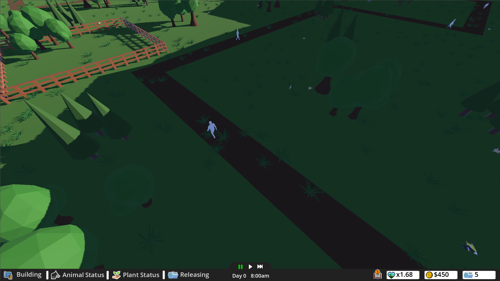  

### Building
The first button, “Building,” will pull up a menu of all of our available buildings. Some buildings, like the research center, can help the user by allowing them to get an extra animal release per day, or the fence can be used to separate or enclose species you need to control the population of.   
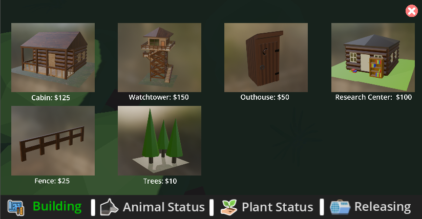  

### Animal Status
The next is the “Animal Status” button. This will list the current count of all of the animals in your environment. This is useful for the user to see their progress on balancing their ecosystem.   
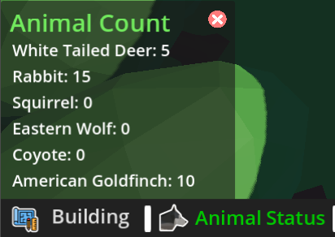  

### Plant Status
Similar to the previous button, “Plant Status” will pull up a menu displaying the current count of grass in your environment. This can help the user understand how having too many herbivores can affect your food count.   
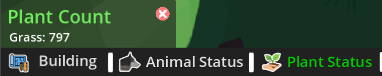  

### Releasing
The last button on the left half is the “Releasing” button. This one is most similarly compared to the building menu. Once clicked, a menu pops up of all of the current animals you can release into your environment.  
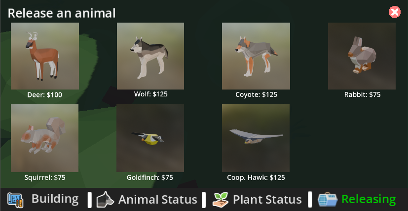  

### Pause, Play, and Fast Forward  
These buttons can be used to help the speed of your environment.  
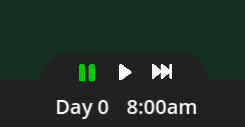  
Pause - Stops all interactions and systems like the animals and guests.  
Play - 1x speed (normal speed).  
Fast Forward - 2x speed.  
These buttons can be best compared to the “Sims” games. Allowing the user to generate income quickly at the expense of losing some control or pausing the game to intervene with a potential issue in your environment before it happens.  

### Fun Fact
The last button located on the right is the “Fun Fact” button.   
  

Clicking the guidebook pulls up a pop-up menu of a random fun fact about the animals we designed, all Ohio native species.  
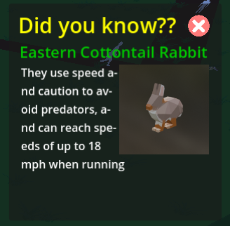  

### Settings Menu
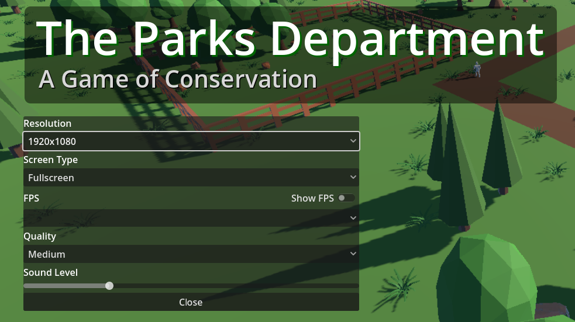  
Resolution: 800x600, 1280x720, 1920x1080 (default), 2560x1440, 3840x2160.  
Window Type: Full Screen (default), Windowed, and Borderless Windowed - *There is a known glitch with the windowed button not working if it’s selected first post-game launch.*  
FPS: 30, 60, 120, 144, and 240 - default set based off system settings.  
Quality (non-functional): Low, Medium (default), and High  

### Escape Menu
If the user was to press "Esc" the game will pause and bring up the following menu.  
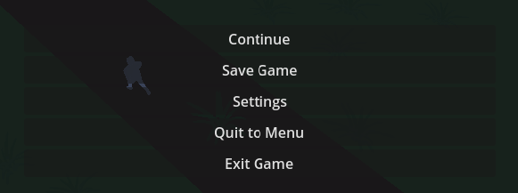  
Continue - Return to Game.  
Save Game (non-functional) - Save the current state of the user's ecosystem to their device.  
Settings - Same as above.  
Quit to Menu - Returns to the main menu screen.  
Exit Game - Closes the application.  

## Test Plan and Results 
In this document is our test plan, I will go through the results in this Document. 

[Test Plan](HW_Assignments\Test_Plan.md)

### Test Results
1. Test Case Identifier: 1
    - Description: The player will move the camera around the map using the arrow keys. The camera should move in the direction of the arrow key that is pressed. The camera should not move off the map.
    - Description of execution: Feature was tested by pressing the arrow keys and observing the camera movement. The camera was moved to the edge of the map and was allowed past it.
    - Result: Partially successful.
2. Test Case Identifier: 2
    - Description: The player will place a building on the map by clicking on the building and then clicking on the map where they want to place the building. The building should be placed on the map where the player clicked.
    - Description of execution: Feature was tested by clicking on the building and then clicking on the map. The building was placed on the map where the player clicked. 
    - Result: Passed
3. Test Case Identifier: 3
    - Description: The player will place an animal on the map by clicking on the animal and then clicking on the map where they want to place the animal. The animal should be placed 
    - Description of execution: Feature was tested by clicking on the animal and then clicking on the map. The animal was placed on the map where the player clicked.
    - Result: Passed
4. Test Case Identifier: 4
    - Description: The player will place a plant on the map by clicking on the plant and then clicking on the map where they want to place the plant. The plant should be placed on 
    - Description of execution: Feature was tested by clicking on the plant and then clicking on the map. The plant was placed on the map where the player clicked.
    - Result: Passed
5. Test Case Identifier: 5
    - Description: The player will place the max amount of plants on the map. The game should not crash.
    - Description of execution:  Feature was tested by placing the max amount of plants on the map. The game did not crash.
    - Result: Passed
6. Test Case Identifier: 6
    - Description: The player will place the max amount of animals on the map. The game should not crash.
    - Description of execution: Feature was tested by placing the max amount of animals on the map. The game did not crash.
    - Result: Passed
7. Test Case Identifier: 7
    - Description: The player will place the max amount of buildings on the map. The game should not crash.
    - Description of execution: Feature was tested by placing the max amount of buildings on the map. The game did not crash.
    - Result: Passed
8. Test Case Identifier: 8
    - Description: The player will place the max amount of animals and plants on the map. The game should not crash.
    - Description of execution:  Feature was tested by placing the max amount of animals and plants on the map. The game did not crash.
    - Result: Passed
9. Test Case Identifier: 9
    - Description: The player will place the max amount of animals, plants, and buildings on the map. The game should not crash.
    - Description of execution: Feature was tested by placing the max amount of animals, plants, and buildings on the map. The game did not crash.
    - Result: Passed
10. Test Case Identifier: 10
    - Description: The player will place the max amount of animals, plants, and buildings on the map and then try to place another animal, plant, or building. The game should not crash.
    - Description of execution: Feature was tested by placing the max amount of animals, plants, and buildings on the map and then trying to place another animal, plant, or building. The game did not crash.
    - Result: Passed
11. Test Case Identifier: 11
    - Description: The player will place the max amount of animals on the map and then wait for a baby animal to be born. The game should not allow for a baby animal to be born.
    - Description of execution: Feature was tested by placing the max amount of animals on the map and then waiting for a baby animal to be born. The game did not allow for a baby animal to be born.
    - Result: Passed
12. Test Case Identifier: 12
    - Description: The player will place the max amount of plants on the map and then wait for a baby plant to be born. The game should not allow for a baby plant to be born.
    - Description of execution: Feature was tested by placing the max amount of plants on the map and then waiting for a baby plant to be born. The game did not allow for a baby plant to be born.
    - Result: Passed
13. Test Case Identifier: 13
    - Description: The player will play the game and the game should stay within the minimum frame rate limit.
    - Description of execution: Feature was tested by playing the game and observing the frame rate. The game stayed within the minimum frame rate limit.
    - Result: Passed
14. Test Case Identifier: 14
    - Description: The player will place the max amount of animals, plants, and buildings on the map and then play the game. The game should stay within the minimum frame rate limit.
    - Description of execution: Feature was tested by placing the max amount of animals, plants, and buildings on the map and then playing the game. The game stayed within the minimum frame rate limit.
    - Result: Passed 
15. Test Case Identifier: 15
    - Description: The player will play the game and the game should not take up more than 75% of the CPU.
    - Description of execution: Feature was tested by playing the game and observing the CPU usage. The game did not take up more than 75% of the CPU.
    - Result: Passed
16. Test Case Identifier: 16
    - Description: The player will place the max amount of animals, plants, and buildings on the map and then play the game. The game should not take up more than 75% of the CPU.
    - Description of execution: Feature was tested by placing the max amount of animals, plants, and buildings on the map and then playing the game. The game did not take up more than 75% of the CPU.
    - Result: Passed
17. Test Case Identifier: 17
    - Description: The player will save the game by clicking on the save button. The game should be saved and the player should be able to load the game from the save file.
    - Description of execution:  Feature did not end up being implemented.
    - Result: Failed
18. Test Case Identifier: 18
    - Description: The player will place the max amount of animals on the map and then try to place another animal. The game should not allow for another animal to be placed.
    - Description of execution: Feature was tested by placing the max amount of animals on the map and then trying to place another animal. The game did not allow for another animal to be placed.
    - Result: Passed
19. Test Case Identifier: 19
    - Description: The player will place the max amount of plants on the map and then try to place another plant. The game should not allow for another plant to be placed.
    - Description of execution:  Feature was tested by placing the max amount of plants on the map and then trying to place another plant. The game did not allow for another plant to be placed.
    - Result: Passed
20. Test Case Identifier: 20
    - Description: The player will place the max amount of buildings on the map and then try to place another building. The game should not allow for another building to be placed.
    - Description of execution: Feature was tested by placing the max amount of buildings on the map and then trying to place another building. The game did not allow for another building to be placed.
    - Result: Passed

## User Manual  
When the user first starts the game, they're given an unbalanced environment only inhabited by herbivores. This might not sound like much of a problem, but the result of not interacting with the environment is the herbivores repopulating and eating all of the available food (grass) faster than it can grow.  
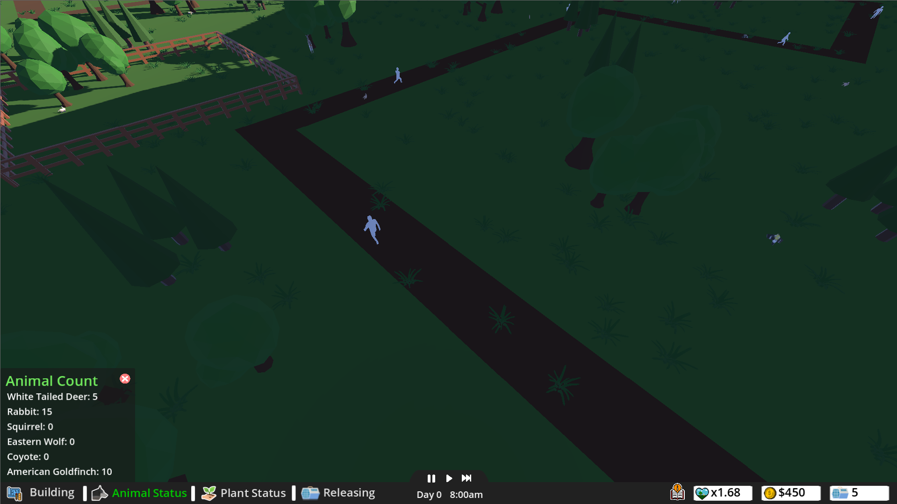    
The user can intervene by releasing carnivores such as the Eastern Wolf, Coyote, or Cooper Hawk to help control the population.  

### Object Placement System:  
When the user wants to place an object in the building or the releasing menu, they first click the desired object's button to select the building or species. Move their mouse to where they want to place the object in the environment, and click once more.  

Building Placement  
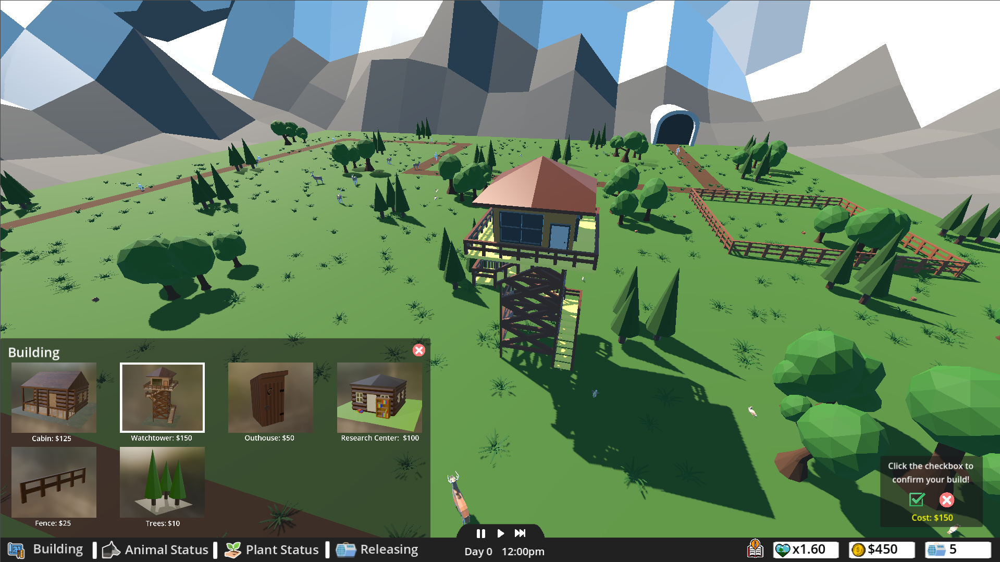    
When the user wants to place a building, the object will follow their mouse to show a projected preview of the placed building.  

Animal Placement  
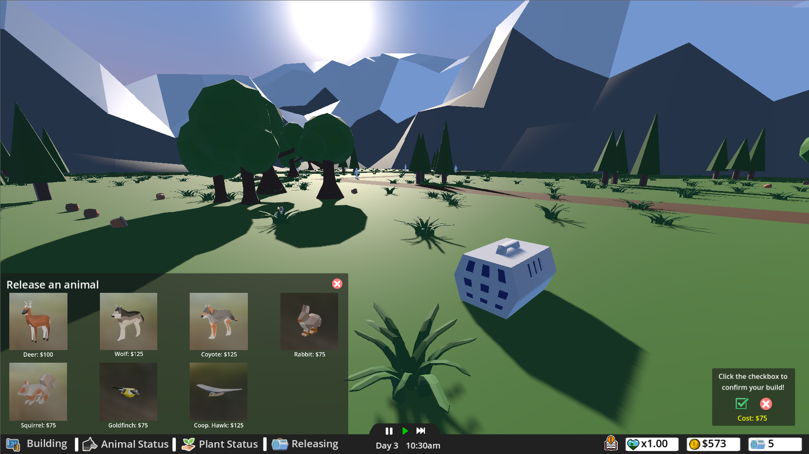  
When the user wants to release/place an animal, an animal-releasing crate will follow the user's mouse. On confirmation, the crate will disappear and the animal will be released into the environment.  

The user should then see a confirmation window appear on the bottom right of the screen. If you don’t see the confirmation window and the previous process didn’t work, it is more than likely due to not having sufficient funds. If you see a confirmation window but can’t place your build, you might’ve double-pressed the button, and it’s now located behind the UI; cancel and try again.  

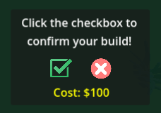  
In the confirmation window, the user can click the check box to confirm their build, or the red X to cancel.  

### Displayed statistics:  
Three important stats are displayed on the bottom right of the UI: ecosystem health, funds, and release count.  
  

### Ecosystem health
  
In order to reward the user for having a natural and balanced ecosystem, the game calculates your ecosystem's health based off the real-world statistic called the Shannon's Biodiversity Index. Using the number of species the user has introduced into their environment, along with tracking the number of animals of each species that are currently alive in the environment, the game will award the user more funds per guest who visited the park.  

### Funds  
  
As the user plays the game, guests will follow a dirt path to view your ecosystem. Once a guest reaches the end tunnel, the guest pays a baseline $5 for their experience. That $5 is then multiplied by the ecosystem health statistic talked about above; the user can generate anywhere between $5 and $25 per guest.  

### Release Count  
  
In order to control the number of animals the user can release into the environment at a time, we've introduced a releasing count system. This limits the user to 5 animal placements per day. The user can build a research center to increase the number of placements by one.  

## Spring Final PPT Presentation
TODO

## Final Expo Poster
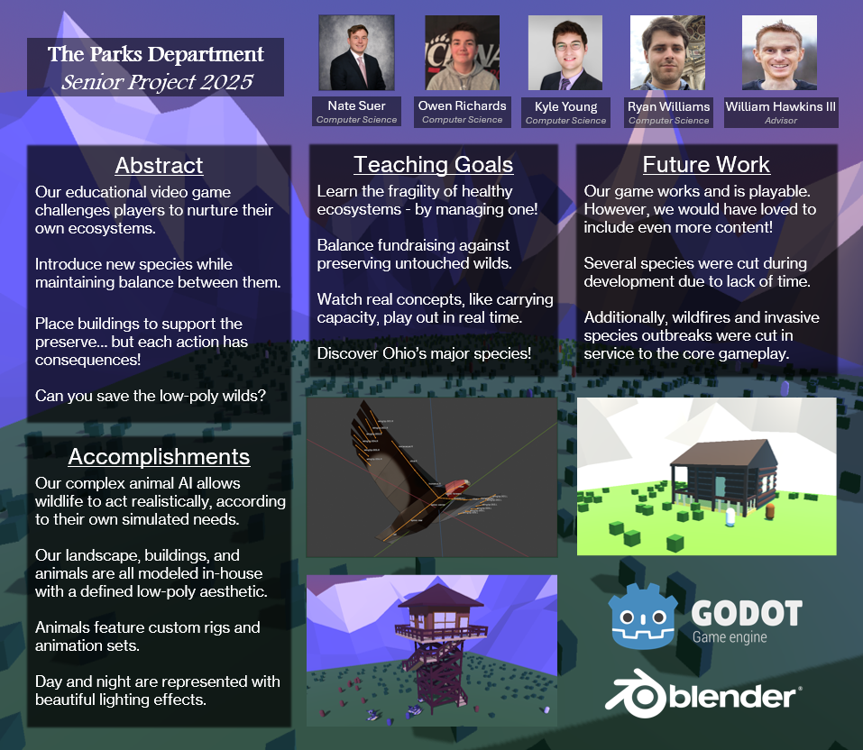

## Assessments
TODO

### Initial Self-Assessments
- [Nathan Suer's Initial Self-Assessment](HW_Assignments/Nathan_Suer_Individual_Capstone_Assessment.md)
- [Ryan Williams's Initial Self-Assessment](HW_Assignments/Ryan_Williams_Individual_Capstone_Assessment.md)
- [Kyle Young's Initial Self-Assessment](HW_Assignments/Kyle_Young_Individual_Capstone_Assessment.md)
- [Owen Richards's Initial Self-Assessment](HW_Assignments/Owen_Richards_Individual_Capstone_Assessment.md)

### Final Self-Assessments
- [Nathan Suer's Final Self-Assessment](HW_Assignments\Nathan_Suer_Self_Assessment.md)
- [Ryan Williams's Final Self-Assessment](HW_Assignments/Ryan_Williams_Self_Assessment.md)
- [Kyle Young's Final Self-Assessment](HW_Assignments/Kyle_Young_Self_Assessment.md)
- [Owen Richards's Final Self-Assessment](HW_Assignments/Owen_Richards_Self_Assessment.md)

## Summary of Hours and Justification

### Nathan Suer
- Designed and Implemented Animal Behavior: 20 Hours
- Tested and Refined Animal AI and Statistics: 10 Hours
- Integrated Animal Animations and Meshes: 5 Hours
- Implemented Animal Dimorphism: 5 Hours
- Meeting Time: 10 Hours

**Total: 50 hours**

Ryan Williams: I was the lead for animal design and animation. Having not worked with Blender beyond the very basics before this project, I had a lot to learn. I put the time in to understand many features of the software, such as the modeling, texuring, rigging and animation suites. Each of the 7 animals (8 with the unimplemented vultures) presented unique challenges, especially when skeletons were unique and required ground-up work. Combine that with male and female variants, as well as unimplemented juveniles, and a single animal was a feat in itself. 

### Ryan Williams

#### Fall Semester 
  - Blender research for keybinds, tools, etc.: 3 hours
  - Blender design time for emplacements (power plant, basic station, campfire): 4 hours
  - Blender design time for natural tiles (forest and variants): 3 hours
  - Animal research, study of forms, artstyle definition: 2 hours
  - Working on final design report: 1 hour
  - Meetings (incl. overages): 29 hours
  - Professional Biography: 1 hour
  - Capstone Assessment: 2 hours

#### Spring Semester
 - Animal Research and Form Study: 3 Hours
 - Animal Sculpting & Topology: 20 Hours
 - Animal Texturing & UV Mapping: 8 Hours
 - Animal Rigging & Animation: 9 Hours
 - Meeting Time: 10 Hours
 - Poster Creation: 4 Hours

**Grand Total: 99 Hours** 

### Project Total Hours
TODO

### Kyle Young
- Refactored Animal AI, Guest Logic, and Fence Generation using Godot best practices: 14 Hours
- Implemeted and refined Camera Movement: 8 Hours
- Added and connected Day Night Cycle: 5 Hours
- Researched and created Ecosystem Grader: 5 Hours
- Created Animal and Structure Placement: 15 Hours
- Meeting Time: 10 Hours
- Material Packing & Transportation for EXPO: 3 Hours

**Total: 60 hours**

### Owen Richards
- Created Main Menu: 5 Hours
- Implemented Setting Options: 5 Hours
- Designed and Implemented User Interface: 15 Hours
- Created Models for Environment and Buildings: 10 Hours
- Linked UI to Animal Count and In-game Clock: 5 Hours
- Meeting Time: 10 Hours

**Total: 50 hours**

##  Summary of Expenses
There has no been no expenses.

## Appendix
### References, citations, links to code repositories, and meeting notes.
We have not used or referenced any other persons work. We are using the Godot engine, which is an open source game engine (https://github.com/godotengine/godot).
