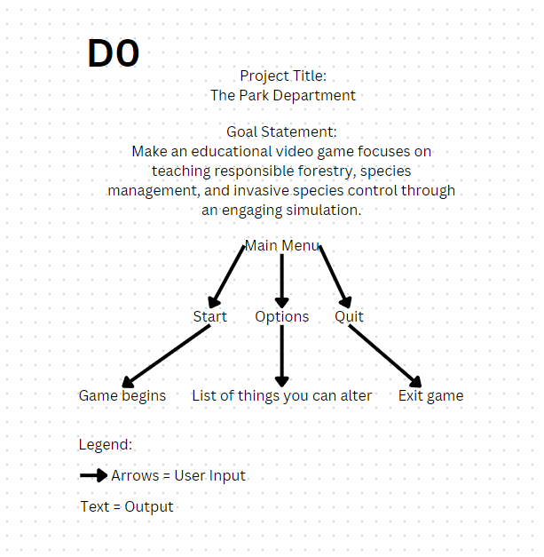
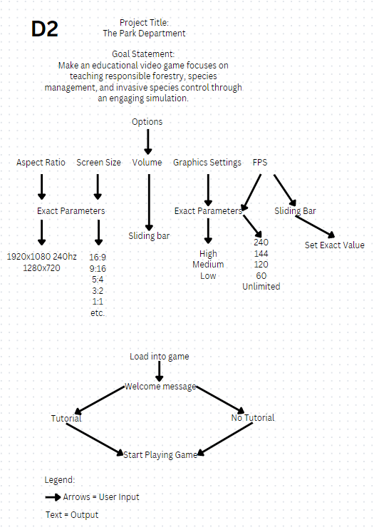

# The Park Department

TODO Remove this
Hi eveyone, I'm not sure if y'all remeber me saying this but I'll be gone for this weeks meeting because I am going out of town for my brothers wedding and can't do HW. I marked areas with nothing in the with 'TODO'.  They expect that all assignments will be atleast minorly updated since our original submission. I made the table of contents and Linked most of our assignments. I hope that this helps you all and I'm sorry I can't be there with y'all to do the rest of the work.

## Table of Contents
- [The Park Department](#the-park-department)
  - [Table of Contents](#table-of-contents)
  - [Team names and Project Abstract](#team-names-and-project-abstract)
  - [Project Description (Assignment #2)](#project-description-assignment-2)
  - [User Stories and Design Diagrams (Assignment #4)](#user-stories-and-design-diagrams-assignment-4)
    - [User Stories](#user-stories)
    - [Design Diagrams: Level 0, Level 1 and Level 2](#design-diagrams-level-0-level-1-and-level-2)
    - [Description of the Diagrams: including conventions and a brief description of the purpose of each component.](#description-of-the-diagrams-including-conventions-and-a-brief-description-of-the-purpose-of-each-component)
  - [Project Tasks and Timeline (Assignment #5-6)](#project-tasks-and-timeline-assignment-5-6)
    - [Task List](#task-list)
    - [Timeline](#timeline)
    - [Effort Matrix](#effort-matrix)
  - [ABET Concerns Essay (Assignment #7)](#abet-concerns-essay-assignment-7)
  - [PPT Slideshow (includes ABET Concerns) (Assignment #8)](#ppt-slideshow-includes-abet-concerns-assignment-8)
  - [Self-Assessment Essays (Assignment #3)](#self-assessment-essays-assignment-3)
  - [Professional Biographies  (Assignment #1)](#professional-biographies--assignment-1)
  - [Budget](#budget)
    - [Expenses to date or statement that there have not been any.](#expenses-to-date-or-statement-that-there-have-not-been-any)
    - [Show monetary value of donated items and donation sources.](#show-monetary-value-of-donated-items-and-donation-sources)
  - [Appendix](#appendix)
    - [Include appropriate references, citations, links to code repositories, and meeting notes.](#include-appropriate-references-citations-links-to-code-repositories-and-meeting-notes)
    - [There should be evidence justifying 45 hours of effort for each team member.](#there-should-be-evidence-justifying-45-hours-of-effort-for-each-team-member)

You can also use the default github table of contents too!

## Team names and Project Abstract
- Nathan Suer
  - Email: natesuer@gmail.com, suerns@mail.uc.edu 
- Ryan Williams
  - Email: willi5r7@mail.uc.edu
- Kyle Young
  - Email: young4kg@mail.uc.edu
- Owen Richards
  - Email: richaroc@mail.uc.edu 
- William Hawkins III (Advisor)
  - Email: hawkinwh@ucmail.uc.edu 

- Project Abstract (TODO double check this, I had to make it less than 400 ascii chars)
  - This educational video game focuses on teaching responsible forestry, species management, and invasive species control through an engaging simulation. It combines elements of animal reserve management with strategic decision-making. Players can also manage the reserve to raise funds, conduct expeditions to find and conserve animals, and protect the reserve from poachers.

## Project Description (Assignment #2)
[Project Description](HW_Assignments/Project-Description.md)

## User Stories and Design Diagrams (Assignment #4)

### User Stories
[User Stories](HW_Assignments/user-stories.md)

### Design Diagrams: Level 0, Level 1 and Level 2 

### Description of the Diagrams: including conventions and a brief description of the purpose of each component.
TODO

## Project Tasks and Timeline (Assignment #5-6)

### Task List
[Task List](HW_Assignments/Tasklist.md)

### Timeline
[Timeline](HW_Assignments/Timeline_Table.csv)

### Effort Matrix
[Task List](HW_Assignments/Effort_Matrix.csv)

## ABET Concerns Essay (Assignment #7)
[ABET Concerns Essay](HW_Assignments/ConstraintEssay.txt)

## PPT Slideshow (includes ABET Concerns) (Assignment #8)
[Slide Show](https://docs.google.com/presentation/d/1j2VIWUOZVFvMsKo1UwIQpQx6Llhs67gb/edit#slide=id.p1)
TODO ( Must include ABET Concerns, which is constraints)

## Self-Assessment Essays (Assignment #3)
- [Nathan Suer's Self-Assessment Essay](HW_Assignments/Nathan_Suer_Individual_Capstone_Assessment.md)
- [Ryan Williams's Self-Assessment Essay](HW_Assignments/Ryan_Williams_Individual_Capstone_Assessment.md)
- [Kyle Young's Self-Assessment Essay](HW_Assignments/Kyle_Young_Individual_Capstone_Assessment.md)
- [Owen Richards's Self-Assessment Essay](HW_Assignments/Owen_Richards_Individual_Capstone_Assessment.md)

## Professional Biographies  (Assignment #1)
- [Nathan Suer's Professional Biography](HW_Assignments/Nathan_Suer_Professional_Bio.md)
- [Ryan Williams's Professional Biography](HW_Assignments/Ryan_Williams_Professional_Bio.md)
- [Kyle Young's Professional Biography](HW_Assignments/Kyle_Young_Professional_Bio.md)
- [Owen Richards's Professional Biography](HW_Assignments/Owen_Richards_Professional_Bio.md)

## Budget 
### Expenses to date or statement that there have not been any.
TODO
### Show monetary value of donated items and donation sources.
TODO

## Appendix
### Include appropriate references, citations, links to code repositories, and meeting notes.
TODO
### There should be evidence justifying 45 hours of effort for each team member.
TODO
